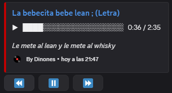
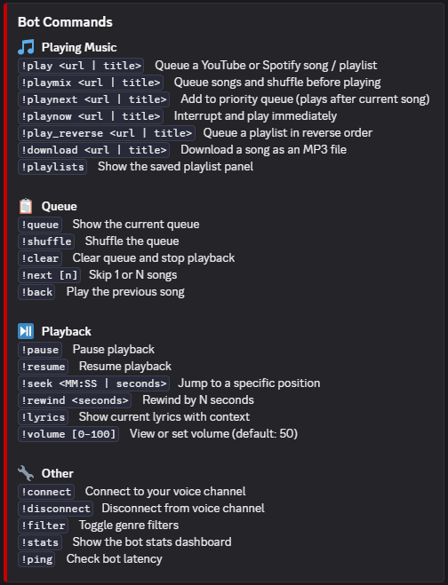
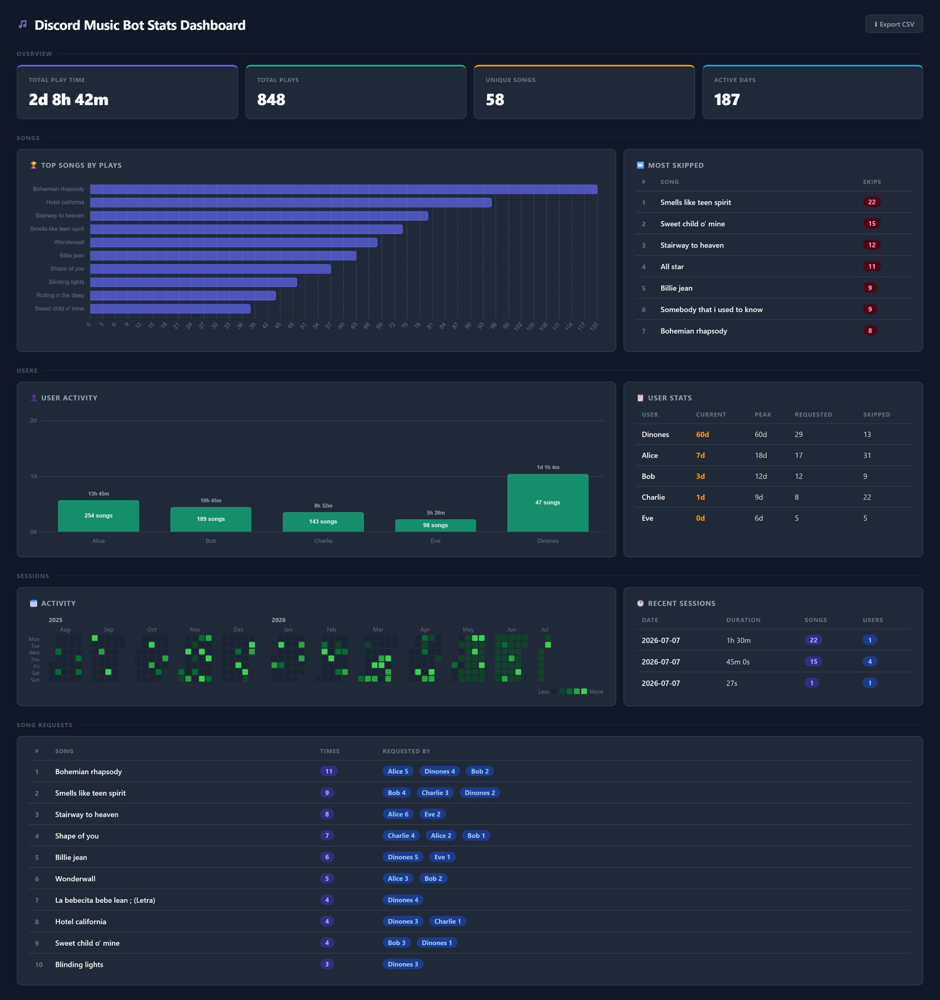

<h1 align="center">🎵ㅤDiscord Music Botㅤ🎵</h1>

<p align="center">
    Play YouTube and Spotify music in Discord with queue controls, synced lyrics, playlist buttons, and listening stats.
</p>

<p align="center">
    <a href="#key-features">Key Features</a> •
    <a href="#screenshots">Screenshots</a> •
    <a href="#python-setup">Setup</a> •
    <a href="Documentation/Discord_Bot_Setup.md">Discord App Setup</a> •
    <a href="Documentation/Cloud_Setup.md">AWS Setup</a>
</p>

<br>

<a id="key-features"></a>

## ✨ㅤKey Features

<p>
    <p>
        &emsp; 🎶ㅤPlay music from YouTube links, YouTube searches, Spotify tracks, Spotify albums, and Spotify playlists. <br>
    </p><p>
        &emsp; 📋ㅤManage playback with queue, priority queue, skip, back, pause, resume, and more controls. <br>
    </p>
    <p>
        &emsp; 🎤ㅤShow synced lyrics while playing the music. <br>
    </p>
    <p>
        &emsp; 📊ㅤTrack listening stats, user activity, skipped songs, sessions, streaks, and top requests. <br>
    </p>
    <p>
        &emsp; ☁️ㅤLoad Discord, Spotify, YouTube cookies, and optional private commands from AWS. <br>
    </p>
</p>

<br>

<a id="screenshots"></a>

## 🖼️ㅤScreenshots

### 🎵ㅤNow Playing

<p align="center">
    
</p>

<br>

### 🤖ㅤCommands

<p align="center">
    
</p>

<br>

### 📊ㅤStats Dashboard

<p align="center">
    
</p>

<br>

<a id="python-setup"></a>

## 🐍ㅤPython Setup

This project requires **Python 3.12**.

### 🪟ㅤWindows Environment

```powershell
python -m venv .venv
.venv\Scripts\activate
pip install -r Requirements.txt
```

### 🐧ㅤLinux Environment

```bash
python3 -m venv .venv
source .venv/bin/activate
pip install -r Requirements.txt
```

<br>

## 🎞️ㅤFFmpeg and Playwright Installation

This bot requires `ffmpeg` to play audio and `playwright` to visualize stats.

### 🪟ㅤWindows Environment

Run a powershell as administrator and run:

```powershell
choco install ffmpeg -y
playwright install chromium
```

### 🐧ㅤLinux Environment

```bash
sudo apt-get update
sudo apt-get install -y ffmpeg
playwright install chromium
playwright install-deps chromium
```

<br>

## 🤖ㅤDiscord App Setup

Create the Discord application, configure the bot token/intents, and install it into your server using [`Documentation/Discord_Bot_Setup.md`](Documentation/Discord_Bot_Setup.md).

<br>

## ☁️ㅤAWS Setup

The bot reads its secrets (Discord token, Spotify credentials, etc.) from AWS Secrets Manager. Follow the steps in [`Documentation/Cloud_Setup.md`](Documentation/Cloud_Setup.md) to provision the required AWS resources and fill the secret values.

<br>

## ⚙️ㅤEnvironment Configuration

Create a `.env` file in the project root to configure local settings. This file is gitignored and never committed.

```env
BOT_ENV=dev
```

| Variable  | Values          | Default | Description                                       |
|-----------|-----------------|---------|---------------------------------------------------|
| `BOT_ENV` | `dev` \| `prod` | `dev`   | Selects which Discord token and channel to use.   |

<br>

On a production server, set `BOT_ENV` as a real environment variable instead of using a `.env` file:

```bash
export BOT_ENV=prod
```

<br>

## 🚀ㅤRun the Bot

### 🪟ㅤWindows Environment

```powershell
.venv\Scripts\activate
python Main.py
```

### 🐧ㅤLinux Environment

```bash
source .venv/bin/activate
python3 Main.py
```
